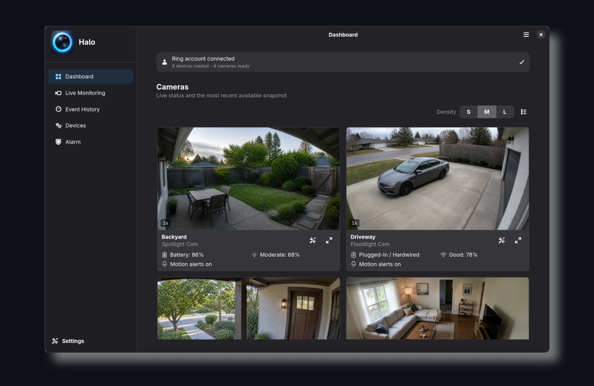
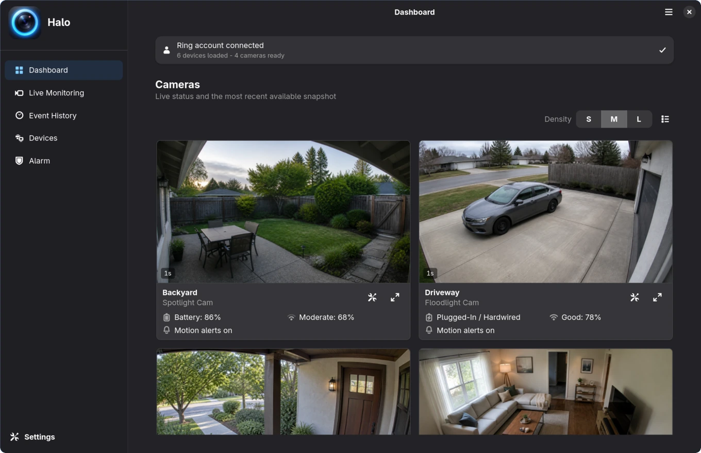
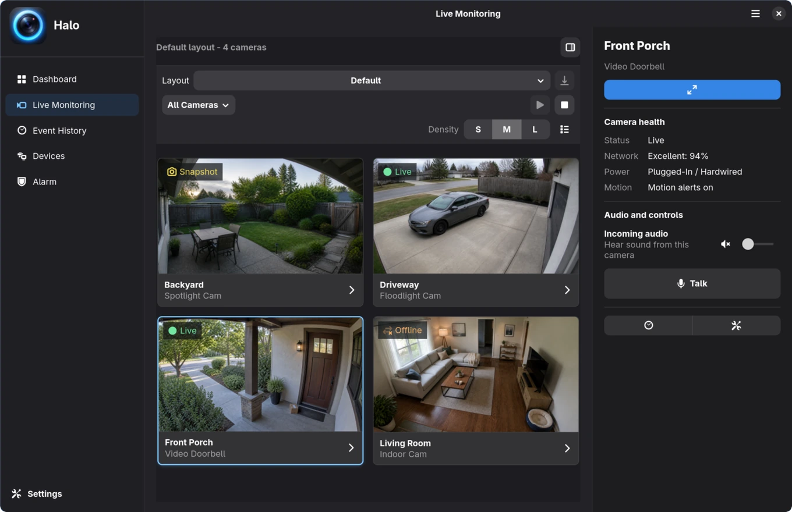
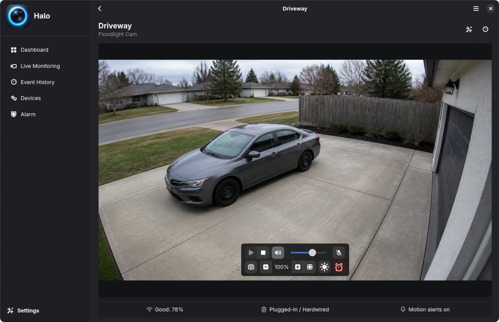
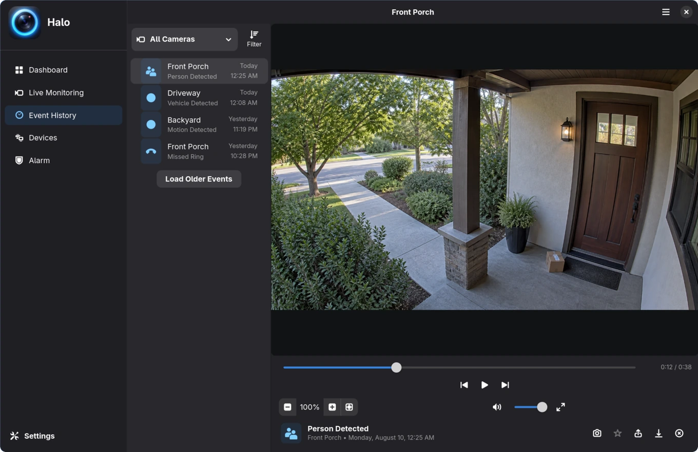
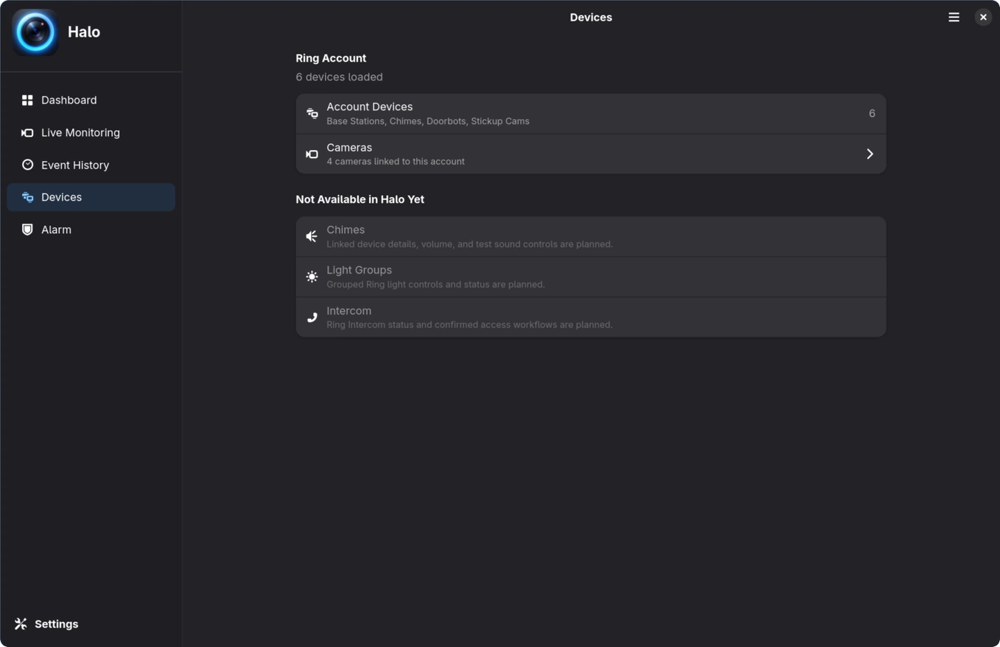
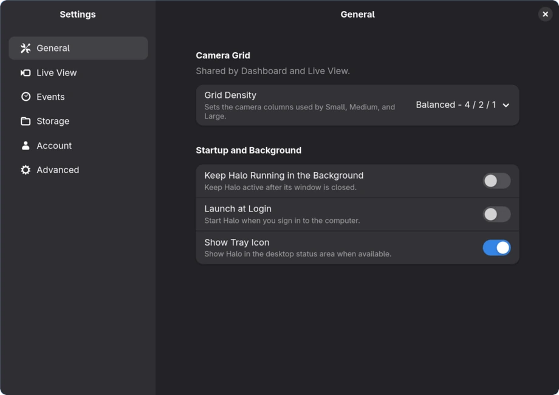

<p align="center">
  
</p>

<h1 align="center">Halo</h1>

<p align="center">
  <strong>Your Ring cameras, at home on Linux.</strong><br>
  A native GTK 4 desktop experience for watching live cameras, reviewing events,
  and keeping an eye on the devices that matter.
</p>

<p align="center">
  <a href="#install-halo">Install</a> &middot;
  <a href="#meet-halo">Product Tour</a> &middot;
  <a href="#requirements">Requirements</a> &middot;
  <a href="#privacy-and-local-data">Privacy</a>
</p>

<p align="center">
  <a href="https://github.com/JamesFromFL/halo-gtk/actions/workflows/ci.yml"></a>
  
  
  
</p>

> [!IMPORTANT]
> Halo is an independent, unofficial project. It is not affiliated with,
> endorsed by, or supported by Ring or Amazon. Ring service changes can affect
> compatibility.

<p align="center">
  
</p>

<p align="center"><sub>Real Halo production widgets shown with synthetic demonstration footage and account data. No private camera feeds or Ring account were used.</sub></p>

## Home monitoring that belongs on the desktop

Halo turns Ring camera access into a focused Linux application instead of
another browser tab. The adaptive interface follows your desktop theme, keeps
camera state visible, and puts common monitoring workflows within one click.

- **See the property at a glance.** Recent snapshots, motion state, power, and
  network health share one clear dashboard.
- **Build the monitoring wall you need.** Choose cameras, save layouts, and
  move between flexible Small, Medium, and Large grid densities.
- **Move from an event to the camera.** Review recorded activity, open focused
  live view, and use supported camera controls without losing your place.
- **Keep useful media close.** Save screenshots, download available recordings,
  and archive important events as local Favorites.

## Meet Halo

### Dashboard

Your home at a glance. The Dashboard pairs a compact account summary with the
latest camera snapshots, clearly labeled freshness, and device health. Open a
camera immediately or adjust its settings without digging through menus.



### Live Monitoring

Turn selected cameras into a scrollable monitoring wall. Start or stop the
wall together, save reusable layouts, filter the cameras on screen, and choose
Balanced `4 / 2 / 1` or Dense `5 / 3 / 2` grid behavior. The camera inspector
keeps audio, talk, light, siren, history, and settings controls nearby when the
connected device supports them.

Halo limits monitoring to four simultaneous streams by default. An optional
six-stream mode is available as an experimental setting because reliability
depends on Ring, the devices, and the local network.



### Focused Live View

Give one camera the full canvas. Halo shows the latest still while live video
connects, then provides playback, volume, two-way talk, screenshots, and
zoom-and-pan inspection from 100% to 250%. Light and siren actions appear only
for devices that expose those capabilities.



### Event History

Filter Ring activity by camera and event type, then review it in an adaptive
list-and-detail workspace. Playback stays image-first: event identity and time
sit below the video instead of covering it. Previous/next navigation, scrubbing,
volume, fullscreen, screenshots, Favorites, sharing, downloads, and deletion
are available where Ring provides the recording and action for the account.



### Devices

See what Halo discovered on the connected account and jump back to the camera
grid. Camera support is the current focus; chimes, light groups, and intercom
families are shown honestly as planned rather than presented as finished
controls.



### Settings

Settings are organized around real tasks: **General**, **Live View**,
**Events**, **Storage**, **Account**, and **Advanced**. Configure grid density,
background behavior, notifications, media folders, stream preferences, account
actions, and diagnostics from an adaptive Adwaita layout.



## Made for Linux monitoring

- **Native GTK 4 and libadwaita.** Halo follows the system light or dark style,
  uses familiar symbolic icons, and adapts from a full navigation ribbon to a
  compact overlay.
- **Desktop event awareness.** Optional notifications can include Ring-provided
  descriptions and preview images, with actions that return to the relevant
  camera or event.
- **Thoughtful stream ownership.** The monitoring wall and focused view reuse
  compatible live sessions while keeping audio and talkback state explicit.
- **Local media tools.** Screenshots, downloaded recordings, Favorites, cache,
  and diagnostics use predictable XDG and user media locations.
- **Desktop credential storage.** Halo stores its Ring session through a
  Secret Service provider such as GNOME Keyring or KeePassXC.

## Install Halo

Halo is currently an alpha source release for Linux. The supported installation
path installs Halo for the current user from a checkout that remains on disk.

### Arch Linux prerequisites

```bash
sudo pacman -S curl python-gobject gtk4 libadwaita libnotify libsecret \
  gstreamer gst-plugins-base gst-plugins-good gst-plugins-bad gst-plugins-ugly \
  gst-libav gst-plugin-gtk4 gst-plugin-pipewire
```

Install the project-pinned `uv` release with its official standalone installer:

```bash
curl -LsSf https://astral.sh/uv/0.11.24/install.sh | sh
export PATH="$HOME/.local/bin:$PATH"
```

Halo requires exactly `uv 0.11.24` so dependency and artifact behavior match
the checked-in lockfile. You can inspect the installer URL before running it.

### Install and launch

```bash
git clone https://github.com/JamesFromFL/halo-gtk
cd halo-gtk
./scripts/install.sh
halo-gtk
```

The installer creates `.venv` with access to system GObject libraries, installs
the locked production dependencies, and adds the launcher, desktop entry,
icons, and settings schema under your user directories. The launcher points to
this checkout, so keep it at the same path while Halo is installed.

If `halo-gtk` is not found after installation, add `$HOME/.local/bin` to your
`PATH` or start it with `$HOME/.local/bin/halo-gtk`.

### Update

From the checkout:

```bash
./scripts/update.sh
```

The update script requires a clean worktree, pulls with fast-forward only, and
reruns the installer.

### Uninstall desktop integration

```bash
./scripts/uninstall.sh
```

This removes the user-local launcher, desktop entry, icons, autostart entry, and
settings schema. It intentionally preserves the checkout, virtual environment,
Ring session, settings, cache, logs, Favorites, and saved media so they are not
silently destroyed.

## Requirements

- Linux with GTK 4 and **libadwaita 1.5 or newer**
- Python 3.11 through 3.14
- `uv` 0.11.24
- PyGObject, GdkPixbuf, GioUnix, Graphene, libnotify, and libsecret
- GStreamer 1.0 with common codecs and `gtk4paintablesink`
- PulseAudio or PipeWire-compatible audio output
- A PulseAudio-compatible microphone source for the current two-way-talk path
- A desktop Secret Service provider for session storage

PyGObject and the GNOME introspection libraries must come from distribution
packages; pip cannot provide the complete native runtime. Package names vary by
distribution. Systems whose base repositories ship libadwaita older than 1.5,
including Debian 12, need a newer supported package source or distribution
release.

The wheel built in CI validates the Python package and bundled application icon.
It does not install the desktop file, GSettings schema, or hicolor icons, so
`scripts/install.sh` remains the supported desktop installation path.

## Privacy and local data

Halo is a Ring cloud client, not an offline or cloud-free security system. It
communicates with Ring services and uses Google Firebase Cloud Messaging for
live Ring events. Halo keeps its own settings and saved media locally and stores
the authenticated Ring session through the desktop Secret Service.

Diagnostic exports are redacted before packaging, but users should still review
an archive before sharing it. Notification previews and descriptions can expose
camera activity on a lock screen, so they remain configurable.

<details>
<summary><strong>Default local paths</strong></summary>

| Data | Default path |
| --- | --- |
| Settings | `~/.config/halo-gtk/settings.json` |
| Live Monitoring layouts | `~/.config/halo-gtk/live-monitoring-layouts.json` |
| Camera nicknames | `~/.config/halo-gtk/device-nicknames.json` |
| Local Favorites | `~/.local/share/halo-gtk/favorites/` |
| Preview cache | `~/.cache/halo-gtk/` |
| Logs | `~/.local/state/halo-gtk/halo-gtk.log` |
| Screenshots | `~/Pictures/halo-gtk` |
| Recording downloads | `~/Videos/halo-gtk` |

Screenshot and recording folders can be changed in Settings.

</details>

## Ring Alarm backend

Halo now includes an **experimental, backend-only** Ring Alarm integration. It
shares the same authenticated Ring session as the camera experience, keeps
Alarm transport failures isolated by location, and publishes immutable,
revisioned snapshots for hubs, panels, and reported sensors.

The reserved Alarm page is not connected to this backend yet. The implementation
uses undocumented Ring CLAP interfaces and has been validated only with bounded
synthetic fixtures. Live, read-only hardware comparison must happen before any
controlled mode testing.

Halo is not an emergency-monitoring interface. The backend intentionally does
not expose panic, dispatch, Alarm siren, lock, switch, schedule, or device
configuration commands. Its protocol behavior was independently implemented
against a pinned
[`ring-client-api` reference](https://github.com/koush/ring/tree/516e96a24ec279168c246795e623b6bfdf58ec45/packages/ring-client-api).

## Current status

Halo is currently **0.1.0 Alpha**. Camera, live-view, history, notification, and
desktop workflows are implemented, but Ring APIs are private and evolving.
Availability varies by device, account permissions, region, subscription, and
Ring service behavior. Keep the official Ring app available for setup,
account management, and critical security workflows.

### Planned work

- Connect the experimental Alarm backend to the reserved UI after controlled
  read-only and mode-control validation with owned hardware.
- Expand support for non-camera Ring devices.
- Add broader Linux packaging, including AUR and Flatpak options.
- Build a dedicated browser for locally saved Favorites and media.
- Add more advanced per-device notification behavior.

<details>
<summary><strong>Development</strong></summary>

```bash
uv venv --system-site-packages
uv lock --check
uv sync --frozen --no-group audit
.venv/bin/halo-gtk
.venv/bin/ruff check --no-cache src tests scripts
.venv/bin/ruff format --check --no-cache src tests scripts
.venv/bin/pytest -q -p no:cacheprovider
uv build --out-dir dist
```

`--system-site-packages` lets the virtual environment use `gi` and the GObject
introspection libraries installed by the distribution.

</details>

## License

Halo is licensed under **GPL-3.0-or-later**. See [LICENSE](LICENSE).

Ring and Amazon are trademarks of their respective owners. Their names are used
only to describe compatibility. Halo is an independent open-source project and
is provided without affiliation, endorsement, or support from Ring or Amazon.
